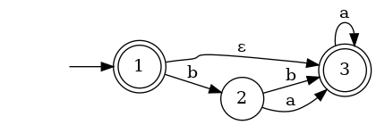

# Dimple - Dima's sIMPLE

Простой единый формат записи конечных автоматов для удобства.

* Состояние - ASCII-строка без пробельных символов.
* Переход -  через пробел: `состояние состояние буква`, либо `состояние состояние` для eps-перехода.
* Сам автомат - 
   1. Стартовое состояние.
   2. Пустая строка
   3. Терминальные состояния, каждое с новой строки.
   4. Пустая строка.
   5. Переходы, каждый с новой строки.
   6. Пустая строка / конец ввода.

Например, следующий `aut.dimple`:

```
1

3
1

1 2 b
1 3
2 3 a
2 3 b
3 3 a
```

задаёт такой автомат:


