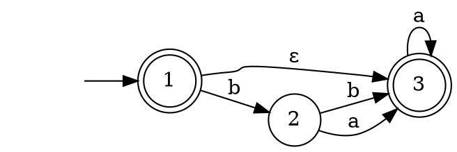
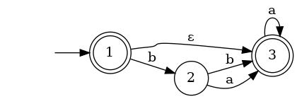

# Graphviz

Для рисования конечных автоматов можно использовать утилиту [graphviz](https://graphviz.org/docs/layouts/).

Например, при таком содержимом `aut.dot`:



следующая команда:

```sh
cat aut.dot | dot -Tpng -o aut.png
```

cоздаст такой файл `aut.png`:


